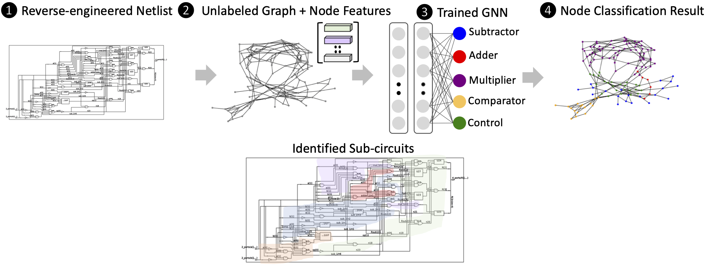

# GNN-RE: Graph Neural Networks for Reverse Engineering of Gate-Level Netlists
Lilas Alrahis, Abhrajit Sengupta, Johann Knechtel, Satwik Patnaik, Hani Saleh, Baker Mohammad, Mahmoud Al-Qutayri and Ozgur Sinanoglu

**Contact**
Lilas Alrahis (lma387@nyu.edu)

### Overview 
GNN-RE is a generic, graph neural network (GNN)-based platform for functional reverse engineering of circuits. GNN-RE (i) represents and analyzes flattened/ unstructured gate-level netlists, (ii) automatically identifies the boundaries between the modules or sub-circuits implemented in such netlists, and (iii) classifies the sub-circuits based on their functionalities. 



### About This Repo
This repo contains the source code of the netlist-to-graph transformation from our paper (TCAD '21, see the [Citation](#Citation-&-Acknowledgement) Section). The scripts released here parse the designs in Netlist format. Please contact Lilas Alrahis (lma387@nyu.edu) if you wish to expand Verilog netlists parsing to handle different tech libs.
### Dependencies
* python >= 3.6.8
* tensorflow >=1.12.0  / pytorch >= 1.1.0
* cython >=0.29.2
* numpy >= 1.14.3
* scipy >= 1.1.0
* scikit-learn >= 0.19.1
* pyyaml >= 3.12
* g++ >= 5.4.0
* openmp >= 4.0

* [GraphSAINT](https://github.com/GraphSAINT/GraphSAINT) - Graph sampling-based training for node classification.
* More info regarding conda env setup/creation is given below.
## Netlist-to-graph Conversion
### Datasets
The `./Netlist_to_graph/Circuits_datasets/` directory contains the `Interconnected-Modules` dataset used in (TCAD'21). The dataset contains 37 designs. Five different sub-circuit classes exist in the dataset, i.e., adders, multipliers, control logic, subtractors, and comparators. All the designs are synthesized using Synopsys Design Compiler with Global Foundries 65nm LPe. **We also release the original `Interconnected-Modules` RTL dataset in `./RTL_Dataset.zip` so that the users can synthesize the designs using different standard cell libs if needed**.

When creating a dataset, the files used for training, validation or testing must be identified. To split files into Test/Train/validate, the files must be named accordingly. A locked file must be named as follows: [Test|Train|Validate]_*.v


### Conversion to Graphs
**Scripts**

The following scripts are required for the conversion:  
`./Netlist_to_graph/Parsers/TheCircuit.pm`: a Perl module we create to ease circuit's parsing. This module is required by our parser `./Netlist_to_graph/Parsers/netlist_to_graph_re.pl`

`./Netlist_to_graph/Parsers/netlist_to_graph_re.pl`: a Perl script that reads all of the designs (Synthesized Gate-level Netlists) in a given dataset and converts the dataset into a single graph. It assigns unique numerical IDs (0 to N-1) to the nodes (gates). N represents the total number of nodes (gates) in the dataset. The list of nodes in the training set will be dumped in `tr.txt`. The list of nodes in the testing set will be dumped in `te.txt`. The list of nodes in the validation set will be dumped in `va.txt`. The extracted features will be dumped in `feat.txt`. The existence of an edge i between two vertices u and v is represented by the entry of ith line in `row.txt` (representing u's ID) and the entry of the ith line in `col.txt` (representing v's ID). The `row_tr.txt` and `col_tr.txt` are created to identify the edges exclusive to the training set.

`./Netlist_to_graph/Parsers/graph_parser.py`: a Python script that processes the files created by the Perl parser and generates the files required by GraphSAINT. It will mainly create the following files:  
`dataset_log.txt`: log file with detailed information about the dataset.  
`adj_full.npz`: a sparse matrix in CSR format, stored as a `scipy.sparse.csr_matrix`. The shape is N by N.  
`adj_train.npz`: a sparse matrix in CSR format, stored as a `scipy.sparse.csr_matrix`. The shape is also N by N. However, non-zeros in the matrix only correspond to edges connecting two training nodes.  
`role.json`: a dictionary of three keys. Key `'tr'` corresponds to the list of all training node indices. Key `va` corresponds to the list of all validation node indices. Key `te` corresponds to the list of all test node indices.  
`class_map.json`: a dictionary of length N. Each key is a node index, and each value is a length C binary list. C represents the number of classes which is 5 in our case, i.e., label 0 for adders, label 1 for multipliers, label 2 for control nodes, label 3 for subtractor nodes, and label 4 for comparator nodes. 
`feats.npy`: a `numpy` array of shape N by F. F is the length of the feature vector. For the case of our dataset, F=34.

**Running the Conversion**   
1) Create and activate conda environment with the required dependencies.
    ```sh
    $ conda create --name myenv python=3.6.8 tensorflow=1.12.0
    $ conda activate myenv
    $ conda install -c anaconda numpy=1.14.3
    $ conda install -c anaconda scipy=1.1.0 
    $ conda install -c anaconda scikit-learn=0.19.1
    $ conda install -c anaconda pyyaml=3.12
    $ conda install -c conda-forge openmp=4.0
    $ conda install -c anaconda cython=0.29.2
    ```
2) Modify line 6 in `./Netlist_to_graph/Parsers/netlist_to_graph_re.pl` and place the full path to `theCircuit.pm`.
3) Perform the conversion:  
    ```sh
    $ mkdir -p ./Netlist_to_graph/Graphs_datasets/Interconnected-Modules/
    $ cd ./Netlist_to_graph/Graphs_datasets/Interconnected-Modules/
    $ cp ../../Parsers/graph_parser.py .
    $ perl ../../Parsers/netlist_to_graph_re.pl -i ../../Circuits_datasets/Interconnected-Modules > log.txt
    $ python graph_parser.py
    $ cd ../../../
    ```
## Node Classification
GNN-RE requires [GraphSAINT](https://github.com/GraphSAINT/GraphSAINT) to perform node classification (ICLR'20). We have used the TensorFlow implementation of GraphSAINT in all of the experiments reported in (TCAD'21).

To install GraphSAINT:
```sh
$ git clone https://github.com/GraphSAINT/GraphSAINT.git
$ cd GraphSAINT
```
Compilation (done only once)
```sh
$ python graphsaint/setup.py build_ext --inplace
```
Launch Node Classification: First activate the created conda env and then:
```sh
$ python -m graphsaint.tensorflow_version.train --data_prefix ../Netlist_to_graph/Graphs_datasets/Interconnected-Modules --train_config ../TCAD.yml --gpu -1 > log_training.txt
```
`TCAD.yml` contains the hyperparameters used in (TCAD'21).

## Citation & Acknowledgement

If you find the code useful, please cite our paper:
* TCAD 2021:
```
@ARTICLE{9530566,
  author={Alrahis, Lilas and Sengupta, Abhrajit and Knechtel, Johann and Patnaik, Satwik and Saleh, Hani and Mohammad, Baker and Al-Qutayri, Mahmoud and Sinanoglu, Ozgur},
  journal={IEEE Transactions on Computer-Aided Design of Integrated Circuits and Systems}, 
  title={{GNN-RE}: Graph Neural Networks for Reverse Engineering of Gate-Level Netlists}, 
  year={2021},
  pages={1-1},
  doi={10.1109/TCAD.2021.3110807}}
```

We owe many thanks to [Hanqing Zeng](https://sites.google.com/a/usc.edu/zengh/home) for making his GraphSAINT code available.


